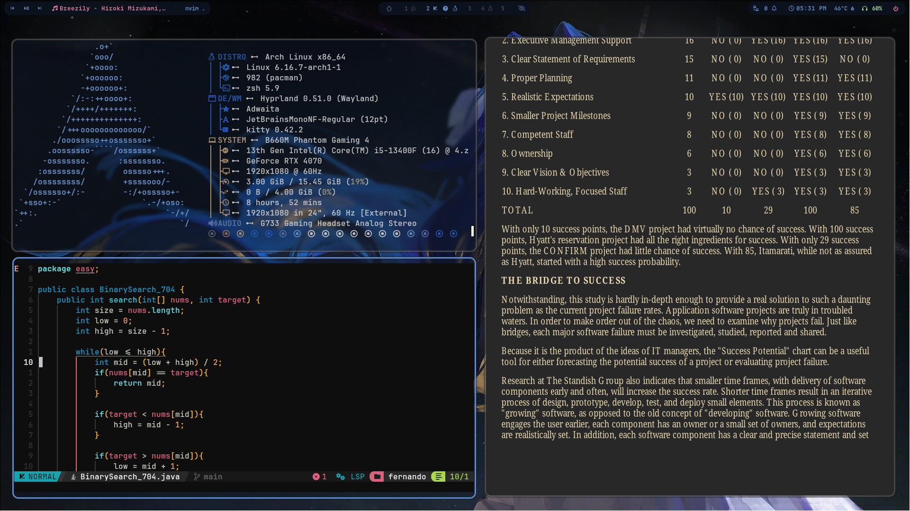

# dotfiles

-if you don't have AUR helper yay, follow the commands below 

```bash
sudo pacman -S --needed base-devel git
git clone https://aur.archlinux.org/yay.rmpc-git

cd yay
makepkg -si
```

-enjoy the enviroment packages 

```zsh
sudo pacman -S --needed fastfetch neovim python-pywal waybar mpd mpc rofi rofi-calc starship papirus-icon-theme ttf-jetbrains-mono ttf-0xproto-nerd yazi ffmpeg 7zip jq poppler fd ripgrep fzf zoxide imagemagick yt-dlp ttf-jetbrains-mono-nerd swww zathura zathura-pdf-poppler nsxiv man-db man-pages
```

```zsh
yay -S --needed swaync wallust rofimoji rmpc-git zsh wlogout
```

## Demonstration




~changes values

xdg-mime default zathura application/pdf
xdg-mime default nsxiv.desktop image/png
xdg-mime default nsxiv.desktop image/jpeg
xdg-mime default nsxiv.desktop image/webp
